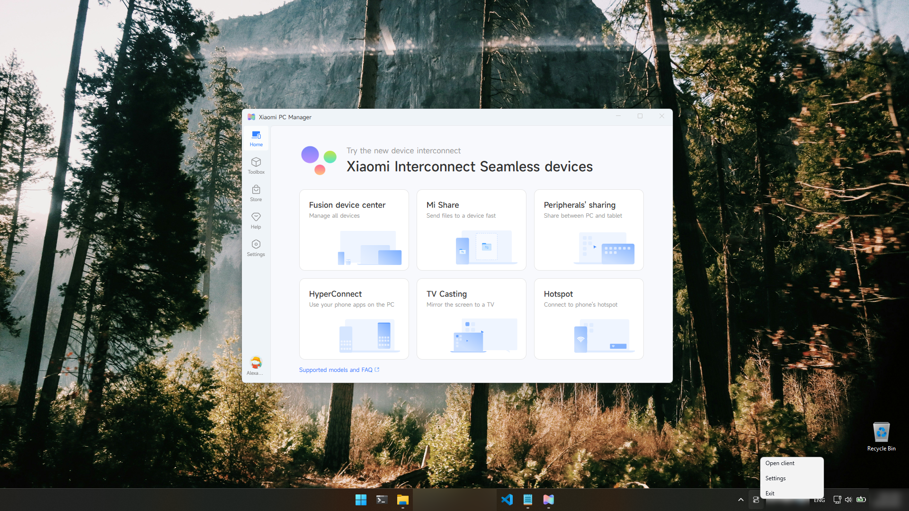

# Xiaomi PC Manager — English UI Patch




**Trying to change Xiaomi PC Manager to English?** There is no language setting for it — this project is the workaround: a turn-key English translation patch for **小米电脑管家 (Xiaomi PC Manager)**, Xiaomi's PC companion app for its laptops, tablets and phones.

The Chinese-market build contains **no English resources at all**: it ignores the Windows display language, exposes no language setting, and there is no official English version or international download. This patch rewrites the app's Chinese UI text — both in its web-based screens and in its native Windows shell — **in place, on your own installation**. One click to install, one click to roll back, and it is not pinned to a specific app build.

## What gets translated

| Area | How |
|---|---|
| Main window, settings, toolbox, drivers, feedback, app store, AI Search (~1,600 string literals) | WebView2 JS bundles, patched with a full zh→en dictionary |
| Hotkey OSD artwork — performance modes (Fn+K), mic mute (F4), keyboard backlight (F10), and every other themed overlay (1,462 images) | Swapped to Xiaomi's own English artwork that already ships inside the app |
| Native shell strings (dialogs, menus, notifications, ~1,400 strings) | WinUI `.pri` resource files, rebuilt with `makepri` |
| Tray menu & tooltip (AI search, screenshot, clipboard, calculator, notepad, task manager, settings, exit) | `.pri` resources + `小米电脑管家` → `Xiaomi` in `MiSmartShareDLL.dll` |
| Cross-device clipboard app (menus, labels) | .NET resources + IL strings in `PcClipboard.exe` |
| Update dialogs (unreadable `????` changelog on non-Chinese Windows) | Replaced with a localized notice |
| Keyboard-backlight OSD artwork (levels 0–10 + Auto, all scales) | Swapped to Xiaomi's own English artwork |

Still Chinese: the province/city region picker data (only used by China-region services) and native OS-level dialogs. Everything visible day-to-day is English.

## Install

1. Install Xiaomi PC Manager (any 5.8.x build).
2. Clone or download this repository.
3. Double-click **`INSTALL-ENGLISH.bat`** and accept the UAC prompt.

The installer detects the newest installed version, backs up every original file it touches into `state\<version>\original\`, builds the patched artifacts (downloading two pinned open-source tools on first run), installs them, and restarts the app. Unknown strings on newer builds simply stay Chinese — the installer reports exactly what it translated and what it skipped, and never refuses to run.

> Note: patching removes the Authenticode signature from `XiaomiPcManager.dll` and `PcClipboard.exe` (the files are modified, so the signature can no longer verify). `RESTORE-CHINESE.bat` puts the signed originals back.

## Roll back

Double-click **`RESTORE-CHINESE.bat`**. Originals are restored from the backups (including backups made by older versions of this patch) and the app restarts in Chinese.

## How it works

Xiaomi PC Manager is a WinUI 3 shell whose screens are rendered in **WebView2**, so the visible text lives in two layers:

- **Web layer** — `scripts/WebBundlePatcher.cs` is a small JS tokenizer (strings, templates, comments, regex literals — regex-based quote pairing corrupts minified bundles) that walks the installed bundles and replaces whole string literals using `translations.json` (1,284 entries). Inside JSON payload strings only whole runs are translated, so region data like `上海` is never corrupted by the single-character key `上`.
- **Native layer** — the PRI resources are dumped to XML with `makepri`, their zh-CN string candidates are replaced from `translations/pri-en.json`, and valid PRI files are rebuilt. A small `SetThreadUILanguage(0x0804)` call is injected at the start of `Program.Main` (via Mono.Cecil) so the process keeps resolving Xiaomi's complete zh-CN resource graph — only the strings inside that graph are replaced. The tray DLL, clipboard app and OSD artwork are patched with the same dictionary-driven approach.

This native-layer technique is adapted from [yoursAnthony/XiaomiPCManager-Locale-Patch](https://github.com/yoursAnthony/XiaomiPCManager-Locale-Patch) (MIT) — see [THIRD_PARTY_NOTICES.md](THIRD_PARTY_NOTICES.md). Their version is pinned to one exact build via SHA-256 checksums; this repository replaced the pinning with capability detection so any 5.8.x build patches best-effort.

### After an app update

Just run `INSTALL-ENGLISH.bat` again. The updater installs a fresh version folder with Chinese files; the installer re-detects it and re-patches. Strings that changed since the dictionaries were written stay Chinese (with a warning listing them) — extend `translations.json` / `translations/pri-en.json` and re-run to cover them.

## Project structure

```text
.
├── INSTALL-ENGLISH.bat          # one-click install (self-elevating)
├── RESTORE-CHINESE.bat          # one-click rollback
├── translations/                # every dictionary lives here
│   ├── web-en.json              # zh→en dictionary for the web UI
│   ├── pri-en.json              # dictionary for native WinUI shell strings
│   └── clipboard-en.json        # dictionary for the clipboard app
├── icons/
│   ├── osd/                     # hand-polished 800×800 English OSD masters
│   └── sources/                 # Photoshop working files (.psd)
├── scripts/
│   ├── Install.ps1              # orchestrator: detect → back up → patch → verify
│   ├── Restore.ps1              # rollback
│   ├── Patch-Web.ps1            # web bundle patcher (uses WebBundlePatcher.cs)
│   ├── WebBundlePatcher.cs      # JS tokenizer + literal translator
│   ├── Patch-Pri.ps1            # zh-CN candidate replacement in PRI dumps
│   ├── Patch-Assembly.ps1       # SetThreadUILanguage injection + update dialogs
│   ├── Patch-NativeString.ps1   # UTF-16 string swap (tray tooltip)
│   ├── Patch-Clipboard.ps1      # clipboard .NET resources + IL strings
│   ├── Patch-OsdEnglish.ps1     # OSD artwork swap to Xiaomi's English images
│   └── priconfig.xml            # makepri rebuild configuration
└── THIRD_PARTY_NOTICES.md
```

No Xiaomi code is redistributed — the scripts and dictionaries are applied locally against your own installation. The one exception is `icons/osd/`, which ships hand-edited English OSD artwork derived from Xiaomi's icons (see the note in that folder); deleting that folder simply falls back to the programmatic redraw.

## Screenshots

<details>
<summary>Expand</summary>


</details>

## FAQ

**Is there an official English version of Xiaomi PC Manager?**
No. Xiaomi distributes this app only in China. It has no language option and ignores the Windows display language, so an English UI is only possible with a patch like this one.

**Can I switch back to Chinese?**
Yes — run `RESTORE-CHINESE.bat` at any time. The installer keeps backups of every original file it replaces.

**Does it work on Windows 10 as well as Windows 11?**
Yes, both are supported (the app itself renders its UI through WebView2).

**My antivirus flags the installer.**
The installer downloads two signed open-source tools (Mono.Cecil and the Windows SDK build tools) and rewrites application files under `C:\Program Files` — behavior heuristics sometimes dislike that. Inspect the scripts in `scripts/`; everything they do is visible in plain PowerShell.

**The app updated itself and Chinese came back — what now?**
Run `INSTALL-ENGLISH.bat` again. See [After an app update](#after-an-app-update).

## Related projects

- [yoursAnthony/XiaomiPCManager-Locale-Patch](https://github.com/yoursAnthony/XiaomiPCManager-Locale-Patch) — the original native-layer locale patch (English + Russian, build-pinned to 5.8.0.57), which this project's native patching technique is adapted from.

## Disclaimer

This is an unofficial fan translation. It is not affiliated with, endorsed by, or supported by Xiaomi. "Xiaomi", 小米电脑管家 and related trademarks belong to Xiaomi Inc. Use at your own risk — the installer backs up every original file it touches, and `RESTORE-CHINESE.bat` undoes the patch at any time.

## License

Released under the [MIT License](LICENSE). The MIT license covers the original work in this repository: the translation dictionaries, the scripts, and the documentation. See [THIRD_PARTY_NOTICES.md](THIRD_PARTY_NOTICES.md) for the licenses of the adapted native-patching technique and the build tools the installer downloads.
